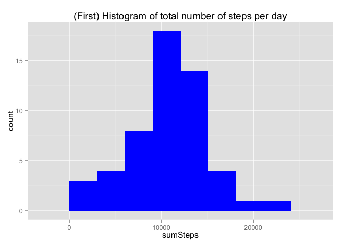
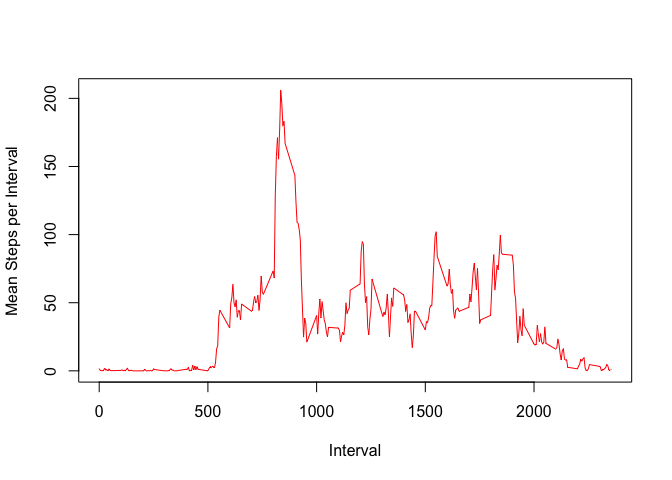
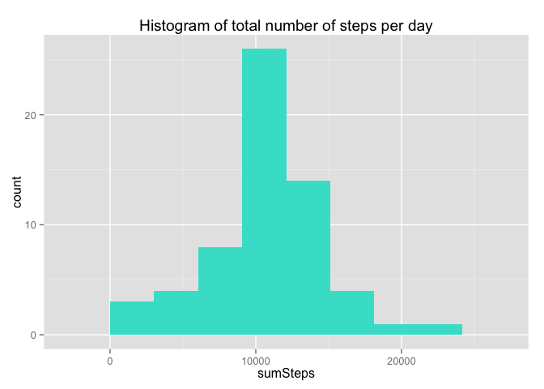
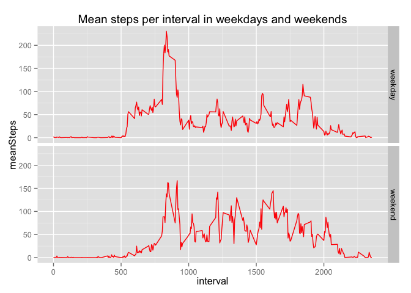

# PA1_template
ds1800  
July 14, 2015  
## Download the data for the research
The data for Project Assignment 1 is available at the URL:

```r
myurl <- "https://d396qusza40orc.cloudfront.net/repdata%2Fdata%2Factivity.zip"
```
So, let us download the data into our working directory for the project, at  
"~/data/reproducibleResearch"

```r
setwd("~/data/reproducibleResearch")
download.file(url = myurl, destfile= "activity.zip", method = "curl")
```

## Read the data
Read the data from the zipped file and examine its structure and summary


```r
data <- read.table(unz("~/data/reproducibleResearch/activity.zip", 
                       "activity.csv"), header=T, quote="\"", sep=",")
dim(data)
```

```
## [1] 17568     3
```

```r
str(data)
```

```
## 'data.frame':	17568 obs. of  3 variables:
##  $ steps   : int  NA NA NA NA NA NA NA NA NA NA ...
##  $ date    : Factor w/ 61 levels "2012-10-01","2012-10-02",..: 1 1 1 1 1 1 1 1 1 1 ...
##  $ interval: int  0 5 10 15 20 25 30 35 40 45 ...
```

```r
summary(data)
```

```
##      steps                date          interval     
##  Min.   :  0.00   2012-10-01:  288   Min.   :   0.0  
##  1st Qu.:  0.00   2012-10-02:  288   1st Qu.: 588.8  
##  Median :  0.00   2012-10-03:  288   Median :1177.5  
##  Mean   : 37.38   2012-10-04:  288   Mean   :1177.5  
##  3rd Qu.: 12.00   2012-10-05:  288   3rd Qu.:1766.2  
##  Max.   :806.00   2012-10-06:  288   Max.   :2355.0  
##  NA's   :2304     (Other)   :15840
```
Let us convert the dates from factor to date:

```r
data$date <- as.Date(as.POSIXct(data$date))
head(data)
```

```
##   steps       date interval
## 1    NA 2012-10-01        0
## 2    NA 2012-10-01        5
## 3    NA 2012-10-01       10
## 4    NA 2012-10-01       15
## 5    NA 2012-10-01       20
## 6    NA 2012-10-01       25
```

## Mean total number of steps taken per day
In the Project Assignment it is specified that "For this part of the assignment, you can ignore the missing values in the dataset."  
So let us collect just the complete cases: 

```r
# ok <- complete.cases(data)   (where is this data?)
# ls(knitr::knit_global(), all = TRUE)
# dim(ok)  # This results in: ## NULL  (why ???)
# sum(ok)  # This results in: 15264
dat1 <- data[complete.cases(data), ]
# get(ls(knitr::knit_global(), all = TRUE)[1], knitr::knit_global())
dim(dat1)
```

```
## [1] 15264     3
```

```r
str(dat1)
```

```
## 'data.frame':	15264 obs. of  3 variables:
##  $ steps   : int  0 0 0 0 0 0 0 0 0 0 ...
##  $ date    : Date, format: "2012-10-02" "2012-10-02" ...
##  $ interval: int  0 5 10 15 20 25 30 35 40 45 ...
```

```r
summary(dat1)
```

```
##      steps             date               interval     
##  Min.   :  0.00   Min.   :2012-10-02   Min.   :   0.0  
##  1st Qu.:  0.00   1st Qu.:2012-10-16   1st Qu.: 588.8  
##  Median :  0.00   Median :2012-10-29   Median :1177.5  
##  Mean   : 37.38   Mean   :2012-10-30   Mean   :1177.5  
##  3rd Qu.: 12.00   3rd Qu.:2012-11-16   3rd Qu.:1766.2  
##  Max.   :806.00   Max.   :2012-11-29   Max.   :2355.0
```

For the next points we need the packages dplyr and ggplot2:

```r
library(dplyr, quietly = TRUE)
```

```
## 
## Attaching package: 'dplyr'
## 
## The following object is masked from 'package:stats':
## 
##     filter
## 
## The following objects are masked from 'package:base':
## 
##     intersect, setdiff, setequal, union
```

```r
library(ggplot2)
```
  
### 1. Calculate the total number of steps taken per day  

```r
dat2 <-
    dat1 %>%
    group_by(date) %>%
    summarize(sum(steps))
dim(dat2)
```

```
## [1] 53  2
```

```r
str(dat2)
```

```
## Classes 'tbl_df', 'tbl' and 'data.frame':	53 obs. of  2 variables:
##  $ date      : Date, format: "2012-10-02" "2012-10-03" ...
##  $ sum(steps): int  126 11352 12116 13294 15420 11015 12811 9900 10304 17382 ...
##  - attr(*, "drop")= logi TRUE
```

```r
summary(dat2)
```

```
##       date              sum(steps)   
##  Min.   :2012-10-02   Min.   :   41  
##  1st Qu.:2012-10-16   1st Qu.: 8841  
##  Median :2012-10-29   Median :10765  
##  Mean   :2012-10-30   Mean   :10766  
##  3rd Qu.:2012-11-16   3rd Qu.:13294  
##  Max.   :2012-11-29   Max.   :21194
```

```r
names(dat2) <- c("date", "sumSteps")
```
### 2. Make a histogram of the total number of steps taken each day  

```r
ggplot(dat2, aes(sumSteps)) +
   geom_histogram(binwidth = (max(dat2$sumSteps)-min(dat2$sumSteps))/7, 
                  fill = "blue") +
   ggtitle("(First) Histogram of total number of steps per day")
```

 

### 3. Calculate and report the mean and median of the total number of steps taken per day

```r
meanSteps <- round(mean(dat2$sumSteps), 2)
medianSteps <- median(dat2$sumSteps)
```

The mean of the total number of steps per day is 10766.19 and the median is 10765.


## Average daily activity pattern

### 1. Time series plot (i.e. type = "l" ) of the 5-minute interval (x-axis) and the average number of steps taken, averaged across all days (y-axis)


```r
dat3 <-
    dat1 %>%
    group_by(interval) %>%
    summarize(mean(steps))
#
dim(dat3)
```

```
## [1] 288   2
```

```r
str(dat3)
```

```
## Classes 'tbl_df', 'tbl' and 'data.frame':	288 obs. of  2 variables:
##  $ interval   : int  0 5 10 15 20 25 30 35 40 45 ...
##  $ mean(steps): num  1.717 0.3396 0.1321 0.1509 0.0755 ...
##  - attr(*, "drop")= logi TRUE
```

```r
summary(dat3)
```

```
##     interval       mean(steps)     
##  Min.   :   0.0   Min.   :  0.000  
##  1st Qu.: 588.8   1st Qu.:  2.486  
##  Median :1177.5   Median : 34.113  
##  Mean   :1177.5   Mean   : 37.383  
##  3rd Qu.:1766.2   3rd Qu.: 52.835  
##  Max.   :2355.0   Max.   :206.170
```

```r
#
names(dat3) <- c("interval", "meanPerInterval")
#
plot(x = dat3$interval, y = dat3$meanPerInterval, type = "l",
     xlab = "Interval", ylab="Mean Steps per Interval", col = "red")
```

 

### 2. Which 5-minute interval, on average across all the days in the dataset, contains the maximum number of steps?


```r
eps = 1*10^-6
maxStp = max(dat3$meanPerInterval)
# Hopefully this will return just one row:
maxInterval <- dat3$interval[dat3$meanPerInterval > (maxStp - eps)]
```

The interval 835 contains the maximum number of steps, which is 206.17 steps.

## Imputing missing values

### 1. Calculate and report the total number of missing values in the dataset (i.e. the total number of rows with NA's)

The number of rows with missing values, or rows with NA's, is precisely the difference between the number of rows of the original dataset **data** minus the number of rows of dataset **dat1**, which lacks these values. So, the number of missing values is: 2304.  

### 2. Devise a strategy for filling in all of the missing values in the dataset  

The strategy does not need to be sophisticated. For example, you could use the mean/median for that day, or the mean for that 5-minute interval, etc.  

There are dates where all the intervals have missing values. Therefore, there is no possibility of obtaining the mean/median for that day.  
Also, it seems simpler to replace the missing value by the mean for that 5-minute interval, since in **dat3** we have the mean for each interval.  
So, for each row in **data** we have to   
1. Detect if the number of `steps` in **data** is a missing value. If such is the case then,  
2. Identify its corresponding interval,  
3. Obtain from **dat3** the mean for such interval,  
4. Replace the missing value by that obtained in 3.

### 3. Create a new dataset that is equal to the original dataset but with the missing data filled in.  


```r
# initialize a new data frame dat4 and change the NA's with the new values
dat4 <- inner_join(data, dat3)
```

```
## Joining by: "interval"
```

```r
for(i in seq(1:dim(dat4)[1])){
    if(is.na(dat4$steps[i])){
        dat4$steps[i] <- dat4$meanPerInterval[i]
        }
}
dat4$date <- as.Date(as.POSIXct(dat4$date))
dim(dat4)
```

```
## [1] 17568     4
```

```r
str(dat4)
```

```
## 'data.frame':	17568 obs. of  4 variables:
##  $ steps          : num  1.717 0.3396 0.1321 0.1509 0.0755 ...
##  $ date           : Date, format: "2012-10-01" "2012-10-01" ...
##  $ interval       : int  0 5 10 15 20 25 30 35 40 45 ...
##  $ meanPerInterval: num  1.717 0.3396 0.1321 0.1509 0.0755 ...
```

```r
summary(dat4)
```

```
##      steps             date               interval      meanPerInterval  
##  Min.   :  0.00   Min.   :2012-10-01   Min.   :   0.0   Min.   :  0.000  
##  1st Qu.:  0.00   1st Qu.:2012-10-16   1st Qu.: 588.8   1st Qu.:  2.486  
##  Median :  0.00   Median :2012-10-31   Median :1177.5   Median : 34.113  
##  Mean   : 37.38   Mean   :2012-10-31   Mean   :1177.5   Mean   : 37.383  
##  3rd Qu.: 27.00   3rd Qu.:2012-11-15   3rd Qu.:1766.2   3rd Qu.: 52.835  
##  Max.   :806.00   Max.   :2012-11-30   Max.   :2355.0   Max.   :206.170
```

### 4. Make a histogram of the total number of steps taken each day  

```r
dat5 <-
    dat4 %>%
    group_by(date) %>%
    summarize(sum(steps))
dim(dat5)
```

```
## [1] 61  2
```

```r
str(dat5)
```

```
## Classes 'tbl_df', 'tbl' and 'data.frame':	61 obs. of  2 variables:
##  $ date      : Date, format: "2012-10-01" "2012-10-02" ...
##  $ sum(steps): num  10766 126 11352 12116 13294 ...
##  - attr(*, "drop")= logi TRUE
```

```r
summary(dat5)
```

```
##       date              sum(steps)   
##  Min.   :2012-10-01   Min.   :   41  
##  1st Qu.:2012-10-16   1st Qu.: 9819  
##  Median :2012-10-31   Median :10766  
##  Mean   :2012-10-31   Mean   :10766  
##  3rd Qu.:2012-11-15   3rd Qu.:12811  
##  Max.   :2012-11-30   Max.   :21194
```

```r
names(dat5) <- c("date", "sumSteps")
#
ggplot(dat5, aes(sumSteps)) +
   geom_histogram(binwidth = (max(dat5$sumSteps)-min(dat5$sumSteps))/7, 
                  fill = "turquoise") +
   ggtitle("Histogram of total number of steps per day")
```

 

## Calculate and report the mean and median of the total number of steps taken per day  


```r
meanSteps2 <- round(mean(dat5$sumSteps), 2)
medianSteps2 <- round(median(dat5$sumSteps), 2)
```

The mean of the total number of steps per day is 10766.19 and the median is 10766.19.


### Do these values differ from the estimates from the first part of the assignment? 

The value of the mean coincides with the estimate from the first part, up to the seven digits reported, whereas the value of the median in the first part is slightly lower than the one obtained presently. 

### What is the impact of imputing missing data on the estimates of the total daily number of steps?

The new mean coincides, in practice, with the mean number of daily steps obtained ignoring missing values, up to the seven digits reported. The frequencies of the number of steps per day is changed; for example, the most common number of steps can be estimated in the histogram that has changed from about 18 to 26, and other lesser values are also changed.

## Are there differences in activity patterns between weekdays and weekends?

For this part, the weekdays() function from the base R may be of some help here. Use the dataset with the filled-in missing values, that is **dat4**, for this part.

### 1. Create a new *factor variable* in the dataset with two levels – “weekday” and “weekend” indicating whether a given date is a weekday or weekend day.

```r
dat6 <- mutate(dat4, weekday = as.factor(weekdays(x = dat4$date)))
dat6 <- mutate(dat6, weekend = as.factor(weekday %in% c("Saturday", "Sunday")))
dataux <- data.frame(c("TRUE", "FALSE"), c("weekend", "weekday"))
names(dataux) <- c("weekend", "weekendFactor")
dat6 <- inner_join(dat6, dataux)
```

```
## Joining by: "weekend"
```

### 2. Make a panel plot 
Make a panel plot containing a time series plot (i.e. type = "l" ) of the 5-minute interval (x-axis) and the average number of steps taken, averaged across all weekday days or weekend days (y-axis). See the README file in the GitHub repository to see an example of what this plot should look like using simulated data.


```r
dat6.weekdays <-
    dat6 %>%
    filter(weekendFactor == "weekday" ) %>%
    group_by(interval) %>%
    summarize(mean(steps))

dat6.weekdays <-
    dat6.weekdays %>%
    mutate(weekendFactor = as.factor(rep("weekday", dim(dat6.weekdays)[1])))

dat6.weekends <-
    dat6 %>%
    filter(weekendFactor == "weekend" ) %>%
    group_by(interval) %>%
    summarize(mean(steps))

dat6.weekends <-
    dat6.weekends %>%
    mutate(weekendFactor = as.factor(rep("weekend", dim(dat6.weekends)[1])))

names(dat6.weekends)
```

```
## [1] "interval"      "mean(steps)"   "weekendFactor"
```

```r
dat7 <- rbind(dat6.weekdays, dat6.weekends)
names(dat7) <- c("interval", "meanSteps", "weekendFactor")
dim(dat7)
```

```
## [1] 576   3
```

```r
str(dat7)
```

```
## Classes 'tbl_df', 'tbl' and 'data.frame':	576 obs. of  3 variables:
##  $ interval     : int  0 5 10 15 20 25 30 35 40 45 ...
##  $ meanSteps    : num  2.251 0.445 0.173 0.198 0.099 ...
##  $ weekendFactor: Factor w/ 2 levels "weekday","weekend": 1 1 1 1 1 1 1 1 1 1 ...
```

```r
summary(dat7)
```

```
##     interval        meanSteps       weekendFactor
##  Min.   :   0.0   Min.   :  0.000   weekday:288  
##  1st Qu.: 588.8   1st Qu.:  2.047   weekend:288  
##  Median :1177.5   Median : 28.133                
##  Mean   :1177.5   Mean   : 38.988                
##  3rd Qu.:1766.2   3rd Qu.: 61.263                
##  Max.   :2355.0   Max.   :230.378
```

```r
ggplot(dat7, aes(interval, meanSteps)) + geom_line(color = "red") +
   facet_grid(weekendFactor ~ .) +
   ggtitle("Mean steps per interval in weekdays and weekends")
```

 

It can be observed a change in activity patterns between weekdays and weekends. In particular the activities appear at a later hour in weekends.  

That is  

# THE END  


